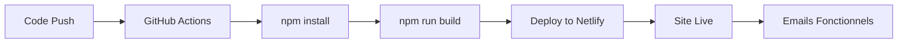

# ✅ Configuration Netlify - Résumé Final

## 🎯 Ce qui a été fait

### 1. **Migration vers Netlify**
- ✅ Workflow GitHub Actions créé (`.github/workflows/netlify-deploy.yml`)
- ✅ Configuration Netlify (`netlify.toml`)
- ✅ Fonction serverless email (`netlify/functions/send-email.mjs`)
- ✅ Variables d'environnement sécurisées (`.env.example`)
- ✅ `.gitignore` mis à jour pour protéger `.env`

### 2. **Système d'emails complet**
- ✅ 8 formulaires intégrés avec envoi d'email
- ✅ 2 destinataires : `infos@digita-energy.com` + `ra@digita-energy.com`
- ✅ Templates HTML professionnels
- ✅ Retry automatique (3 tentatives)
- ✅ Gmail SMTP configuré

### 3. **Documentation**
- ✅ `NETLIFY_DEPLOYMENT.md` - Guide complet de déploiement
- ✅ `DEPLOYMENT_CHANGES.md` - Résumé des changements
- ✅ `QUICK_START.md` - Guide de démarrage rapide
- ✅ `GMAIL_SMTP_SETUP.md` - Configuration Gmail
- ✅ `EMAIL_INTEGRATION_SPECS.md` - Spécifications emails
- ✅ `.env.example` - Template de configuration
- ✅ `README.md` mis à jour

## 📋 TODO : Avant de pousser sur GitHub

### Étape 1 : Créer le compte Netlify
1. ✅ Aller sur https://netlify.com
2. ✅ Se connecter avec GitHub
3. ✅ Créer un nouveau site
4. ✅ Récupérer le `NETLIFY_SITE_ID`
5. ✅ Générer un `NETLIFY_AUTH_TOKEN`

### Étape 2 : Configurer GitHub Secrets
1. ✅ Aller sur GitHub → Settings → Secrets and variables → Actions
2. ✅ Ajouter `NETLIFY_AUTH_TOKEN`
3. ✅ Ajouter `NETLIFY_SITE_ID`

### Étape 3 : Configurer Netlify Production
1. ✅ Site settings → Environment variables
2. ✅ Ajouter `GMAIL_USER=adioyerm@gmail.com`
3. ✅ Ajouter `GMAIL_APP_PASSWORD=auiuxdsbluezdiin`

### Étape 4 : Pousser sur GitHub
```bash
# Vérifier les fichiers modifiés
git status

# Ajouter tous les changements
git add .

# Commit
git commit -m "feat: Configure Netlify deployment with email functionality"

# Push (déclenche le déploiement automatique)
git push origin main
```

## 🧪 Test Local Avant Push

```bash
# 1. Tester avec Netlify Dev
netlify dev

# 2. Aller sur http://localhost:8888/modern-website/

# 3. Tester un formulaire (ex: Transformateurs)

# 4. Vérifier que l'email est reçu sur infos@digita-energy.com
```

## 📊 Workflow de Déploiement



## ✅ Checklist Finale

Avant de considérer le projet prêt pour la production :

- [x] Fonction email créée et testée localement
- [x] Tous les formulaires intégrés
- [x] Workflow GitHub Actions configuré
- [x] Documentation complète
- [x] `.env.example` créé
- [x] `.gitignore` mis à jour
- [ ] **Compte Netlify créé** 👈 À FAIRE
- [ ] **Secrets GitHub ajoutés** 👈 À FAIRE
- [ ] **Variables Netlify configurées** 👈 À FAIRE
- [ ] **Premier déploiement réussi** 👈 À FAIRE
- [ ] **Emails testés en production** 👈 À FAIRE

## 🎉 Une fois Déployé

Votre site sera accessible sur :
- URL Netlify : `https://VOTRE-SITE.netlify.app`
- (Optionnel) Domaine custom : `https://www.digita-energy.com`

## 🔗 Liens Importants

**Documentation :**
- [Guide Déploiement Netlify](./NETLIFY_DEPLOYMENT.md)
- [Guide Démarrage Rapide](./QUICK_START.md)
- [Changements de Déploiement](./DEPLOYMENT_CHANGES.md)

**Services :**
- [Dashboard Netlify](https://app.netlify.com)
- [GitHub Actions](https://github.com/VOTRE_USERNAME/modern-website/actions)
- [GitHub Secrets](https://github.com/VOTRE_USERNAME/modern-website/settings/secrets/actions)

## 💡 Conseils

1. **Testez toujours localement** avec `netlify dev` avant de pousser
2. **Vérifiez les logs** GitHub Actions en cas d'échec
3. **Consultez les logs Netlify** pour débugger les fonctions
4. **Ne commitez JAMAIS** le fichier `.env`

---

**Prêt à déployer ?** Suivez [NETLIFY_DEPLOYMENT.md](./NETLIFY_DEPLOYMENT.md) ! 🚀
